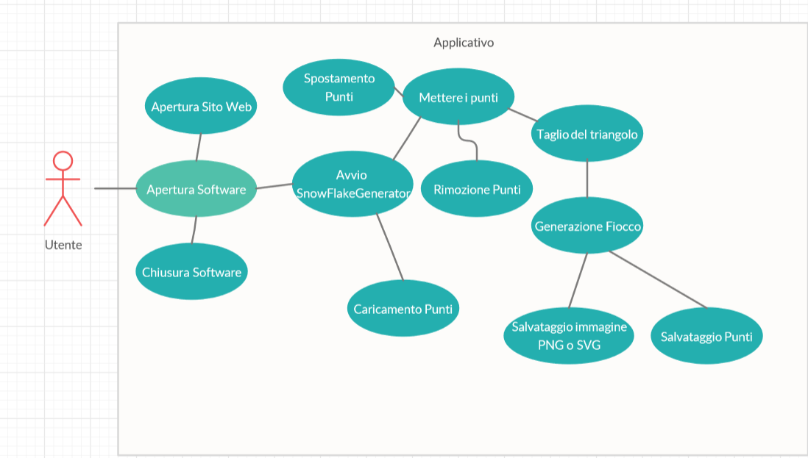
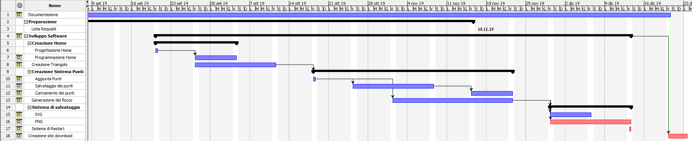
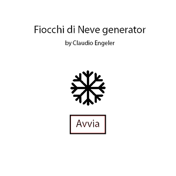
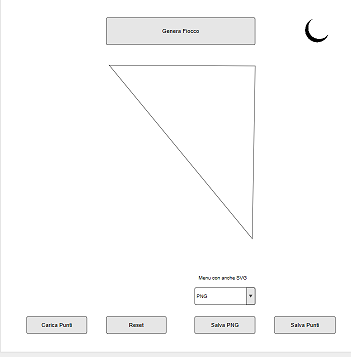
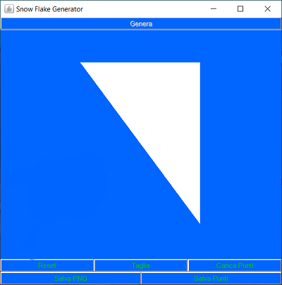
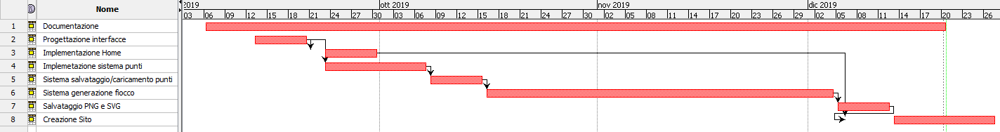

1. [Introduzione](#introduzione)

   - [Informazioni sul progetto](#informazioni-sul-progetto)

   - [Abstract](#abstract)

   - [Scopo](#scopo)

2. [Analisi](#analisi)
  
   - [Analisi dei mezzi](#analisi-dei-mezzi)

   - [Analisi e specifica dei requisiti](#analisi-e-specifica-dei-requisiti)

   - [Use case](#use-case)

   - [Pianificazione](#pianificazione)

3. [Progettazione](#progettazione)

   - [Design dell’architettura del sistema](#design-dell’architettura-del-sistema)

4. [Implementazione](#implementazione)

5. [Test](#test)

   - [Protocollo di test](#protocollo-di-test)

   - [Risultati test](#risultati-test)

   - [Mancanze/limitazioni conosciute](#mancanze/limitazioni-conosciute)

6. [Consuntivo](#consuntivo)

7. [Conclusioni](#conclusioni)

   - [Sviluppi futuri](#sviluppi-futuri)

   - [Considerazioni personali](#considerazioni-personali)

8. [Sitografia](#sitografia)

## Introduzione

### Informazioni sul progetto

  -   Allievo: Claudio Engeler
  
  -   Docenti coinvolti: Muggiasca Luca e Petrini Geo

  -   SAM Trevano , Informatica , Modulo 306 + Progetti

  -   Inizio : 06/09/2019

  -   Consegna: 20/12/2019

  -   Presentazioni: 7/1/2020 - 17/1/2020   

### Abstract

  Snowflakes are a mysterious thing because each one is different from the other, two flakes cannot be the same. So why we don't have a way to create our personal one? This is the goal of this project, allow everyone to create their own snowflakes. With just a triangle and some click arround it we can create basically all snowflakes in the world, it will take forever, but is possible to create them all.

### Scopo

Creare un applicativo che, dato un triangolo “di carta”, tramite tagli consecutivi possa generare un fiocco di neve.

## Analisi

### Analisi e specifica dei requisiti

|**ID**|**Nome**|**Priorità**|**Vers**|**Note**|
|:----:|:------:|:----------:|:------:|:------:|
|Req-01 | L’applicativo può essere scritto in Java o JS |1|1.0| Scelta: Java |
|Req-02 | Creazione di un piccolo sito adibito alla descrizione e download dell’applicativo |1|1.0|Solo se Java|
|Req-03 | La finestra deve essere ridimensionabile | 1 | 1.0 | - |
|Req-04 | I punti di taglio sono da inserire con il mouse|1|1.0|-|
|Req-05 | Rimozione e spostamento dei punti |2|1.0|Bonus|
|Req-06 | Il fiocco di neve finale viene generato con il tasto genera |1|1.0|-|
|Req-07 | La generazione avviene in tempo reale |2|1.0|Bonus|
|Req-08 | L’applicativo deve permettere di salvare il fiocco come immagine PNG o SVG |1|1.0|-|
|Req-09 | L’applicativo deve permettere di salvare i punti di taglio per permettere modifiche future |1|1.0|-|
|Req-10 | L'applicativo deve avere un tasto per permettere il reset totale | 1 | 1.0 | - |
|Req-11 | L'applicativo deve avere un'interfaccia grafica | 1 | 1.0 | - |
|Req-12 | L'applicativo deve permettere la scelta delle dimensioni del salvataggio | 1 | 1.0 | - |
|Req-13 | Il sito deve avere la lista sei requisiti minimi, versione JRE da usare e una mini guida d'uso | 1 | 1.0 | - |
|Req-14 | L'applicazione deve permettere la scelta del formato di salvataggio | 1 | 1.0 | - |
|Req-15 | Il sito deve permettere il download del JAR | 1 | 1.0 | - |
|Req-16 | L'applicativo deve permettere di scegliere le dimensioni dell'immagine che verrà salvata tra: dimensione schermo, 500x500, 1000x1000 | 1 | 1.0 | - |
|Req-17 | L'applicativo deve permettere di caricare un file che contiene dei punti | 1 | 1.0 | - |
  

**Spiegazione elementi tabella dei requisiti:**

**ID**: identificativo univoco del requisito.

**Nome**: breve descrizione del requisito.

**Priorità**: indica l’importanza di un requisito nell’insieme del
progetto, definita assieme al committente.

**Versione**: indica la versione del requisito.

**Note**: eventuali osservazioni importanti o riferimenti ad altri
requisiti.

### Use case

### Pianificazione

### Analisi dei mezzi

NetBeans: versione 11.2

PhotoShop per schizzare le interfacce del software.

Java 13 di Oracle: https://www.oracle.com/technetwork/java/javase/downloads/jdk13-downloads-5672538.html

ImageTracer di András Jankovics per il salvataggio in SVG: https://github.com/jankovicsandras/imagetracerjava

Software sviluppato su Windows, eseguibile su Windows, MacOS e Linux con Java versione 13 o superiore.

## Progettazione

Questo capitolo descrive esaustivamente come deve essere realizzato il
prodotto fin nei suoi dettagli. Una buona progettazione permette
all’esecutore di evitare fraintendimenti e imprecisioni
nell’implementazione del prodotto.

### Design dell’architettura del sistema

### Design delle interfacce

Questa è la home che avevo progettato di fare.

Invece questa è quella finale, che sono abbastanza simili.

Questo è il primo schizzo dell'interfaccia con il triangolo e i bottoni, che è completamente diverso rispetto a quello finale.

Questa è invece  è l'interfaccia triangolo finale.

## Implementazione

<ul>
  <li>TrianglePanel</li>
  <ul>
    <li>Si occupa di tutto il funzionamanto del programma.</li>
  </ul>
   
  <li>Polygon2</li>
  <ul>
    <li>Sono i poligoni con delle funzioni in più, come la possibilità di essere roteati.</li>
  </ul>
   
  <li>Area51</li>
  <ul>
    <li>Oggetto area con delle funzioni in più, come la possibilità di ritornare i punti che la compongono grazie a PathIterator.</li>
  </ul>
   
  <li>Frame</li>
  <ul>
    <li>Finestra che mostra TrianglePanel.</li>
  </ul>
   
  <li>HomeFrame</li>
  <ul>
    <li>Finestra che la schermata Home, permette di:</li>
      <ul>
        <li>Avviare il programma</li>
        <li>Andare sul sito Web</li>
      </ul>
  </ul>
</ul>

## Test

### Protocollo di test

|Test Case      | TC-001                               |
|---------------|--------------------------------------|
|**Nome**       |Mettere i punti |
|**Riferimento**|REQ-004                               |
|**Descrizione**|I punti di taglio sono da inserire con il mouse |
|**Procedura**     | - Avviare il software, cliccare in un punto qualsiasi |
|**Risultati attesi** |Il punto dovrebbe apparire nella finestra |

 

|Test Case      | TC-002                               |
|---------------|--------------------------------------|
|**Nome**       |Ridimensionamento finestra |
|**Riferimento**|REQ-003                               |
|**Descrizione**|La finestra deve essere ridimensionabile |
|**Procedura**     | - Avviare il software, ridimensionare la finestra |
|**Risultati attesi** |La finistra dovrebbe cambiare dimensione |

 

|Test Case      | TC-003                               |
|---------------|--------------------------------------|
|**Nome**       |Rimozione e spostamento dei punti |
|**Riferimento**|REQ-005                               |
|**Descrizione**|Rimozione e spostamento dei punti |
|**Procedura**     | - Avviare il software, mettere un punto, trascinare il cursore sul punto ,cliccare con il tasto destro su di esso. |
|**Risultati attesi** | Il punto dovrebbe prima spostarsi e poi sparire |

 

|Test Case      | TC-004                               |
|---------------|--------------------------------------|
|**Nome**       |Generazione fiocco |
|**Riferimento**|REQ-006                               |
|**Descrizione**|Il fiocco di neve finale viene generato con il tasto genera |
|**Procedura**     | - Avviare il software, mettere almeno 3 punti, cliccare su Taglia e poi su genera |
|**Risultati attesi** | Il fiocco dovrebbe venire generato |

 

|Test Case      | TC-005                               |
|---------------|--------------------------------------|
|**Nome**       |Salvataggio immagine fiocco |
|**Riferimento**|REQ-008                               |
|**Descrizione**| L’applicativo deve permettere di salvare il fiocco come immagine PNG o SVG |
|**Procedura**     | - Avviare il software, mettere almeno 3 punti, cliccare su Taglia e poi su genera, poi cliccare su salva PNG o SVG |
|**Risultati attesi** | Il fiocco dovrebbe venire salvato in un file png o svg |

 

|Test Case      | TC-006                              |
|---------------|--------------------------------------|
|**Nome**       |Salvataggio punti |
|**Riferimento**|REQ-009                               |
|**Descrizione**| L’applicativo deve permettere di salvare i punti |
|**Procedura**     | - Avviare il software, mettere almeno 1 punto, cliccare su salva punti |
|**Risultati attesi** | I punti dovrebbero venire salvati in un file |

 

|Test Case      | TC-007                              |
|---------------|--------------------------------------|
|**Nome**       |Reset |
|**Riferimento**|REQ-010                               |
|**Descrizione**| L’applicativo deve permettere il reset totale |
|**Procedura**     | - Avviare il software, generare un fiocco, cliccare su reset |
|**Risultati attesi** | L'applicazione dovrebbe tornare allo stato iniziale |

 

|Test Case      | TC-008                              |
|---------------|--------------------------------------|
|**Nome**       | Importazione dei punti |
|**Riferimento**|REQ-017                               |
|**Descrizione**| L’applicativo deve permettere l'importazione dei punti |
|**Procedura**     | - Avviare il software, cliccare su carica putni, scegliere un file .points |
|**Risultati attesi** | I punti dovrebbero apparire sullo schermo |

### Risultati test

|TestCase| Stato |
|--------|-------|
| Test 1 | Ok |
| Test 2 | Ok |
| Test 3 | Ok |
| Test 4 | Ok |
| Test 5 | Ok |
| Test 6 | Ok |
| Test 7 | Ok |
| Test 8 | Ok |

### Mancanze/limitazioni conosciute

Per mancanza di tempo e di esperienza personale nel progetto non è presente la funzione per scegliere la dimensione dell'immagine quando la si salva e i punti non sono responsive.
Inoltre non è presente la generazione in live del fiocco.

## Consuntivo

## Conclusioni

Grazie a questo applicativo ogniuno sarà in grado di creare il suo fiocco di neve.

### Sviluppi futuri
  Aggiungere le cose elencate nella sezione [Mancanze/limitazioni conosciute](#mancanze/limitazioni-conosciute).

### Considerazioni personali

  Durante lo svolgimento del progetto ho imparato ad usare i bottoni che prima non sapevo usare, ho usato oggetti, tipo Area, che non avevo mai usato. 

### Sitografia

-   https://stackoverflow.com/, *Stack Overflow - Where Developers Learn, Share, & Build Careersl*, 20-12-2019.
